
 

# Military accounting system

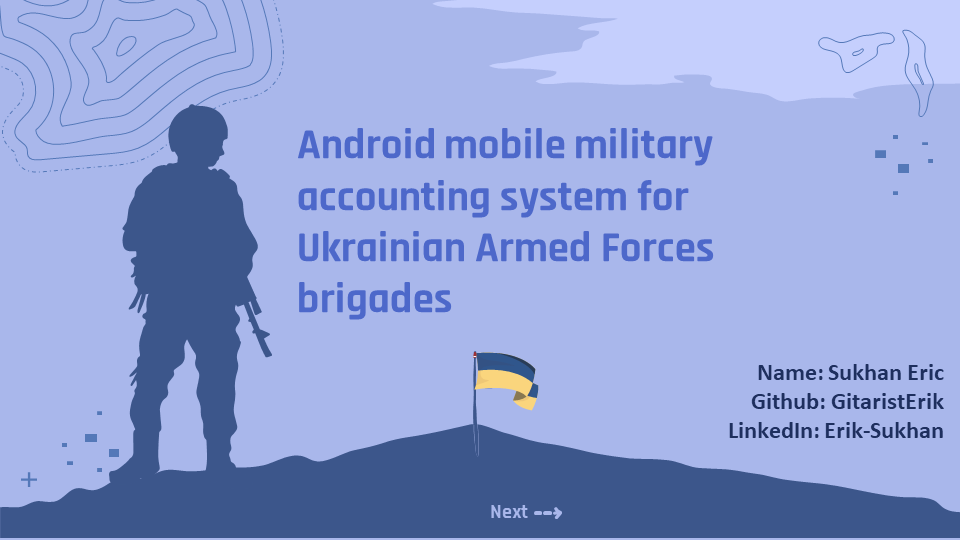
<!-- ---------- Badges ---------- -->
  

    
    
    
    
    
    
    
    
    
     
  

> Diploma work at university, the mobile android app is designed to facilitate the accounting and control of resources, as well as the exchange of information between military personnel of different ranks.
>
> -----------------
>
> ***In Ukrainian***:
> *Дипломна робота для університету, мобільний android додаток призначений для полегшення ведення обліку та контролю ресурсів, а також обміну інформацією між військовослужбовцями різних рангів.*

## 📖 Table of content

* [📱 `Overview`](#iphone-overview)
* [✨ `Demonstration`](#sparkles-demonstration)
* [👇 `Download`](#point_down-download)
* [🛠️ `Project Setup`](#hammer_and_wrench-project-setup)
* [🛠️ `Architecture`](#hammer_and_wrench-architecture)
* [🛠️ `Tech stack & Open-source libraries`](#[building_construction-tech-stack-&-open-source-libraries)
* [🤝 `Join the team`](#handshake-join-the-team)
* [✍️ `Author`](#pencil2-author)
* [⭐️ `Stats`](#star-Stats)

- [📃 `License`](#scroll-license)

[//]: # (## 📱 Overview)

## :iphone: Overview

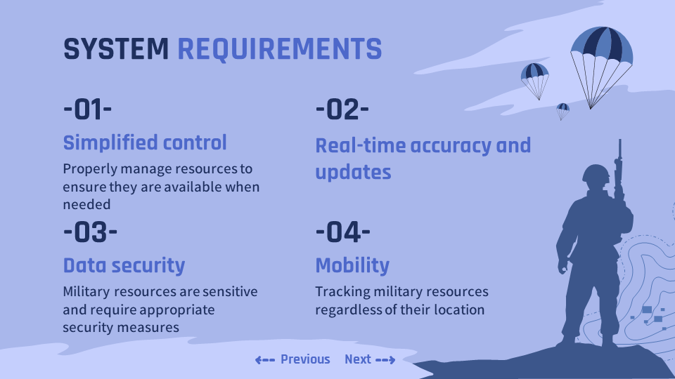

#### Main functions and features of the application

This mobile military accounting system was developed for the Android platform and has the potential to be used not only by the Armed Forces of Ukraine, but also by other military and law enforcement agencies. It allows military personnel of all ranks to conveniently and efficiently manage supplies such as ammunition, materials and provisions. The software provides different levels of access depending on the position, providing only the necessary information for each user. Security measures ensure data confidentiality and security.

This development was created to support the military in the performance of their duties and facilitate their mission at the front. It combines the latest technology with mobile accessibility, making it indispensable in a combat environment. This mobile application was developed with the belief in victory and support of our military.

> #### *In Ukrainian: Основні функції та особливості програми*
>
>*Ця мобільна система військового обліку розроблена для платформи Android та має потенціал для використання не тільки Збройними Силами України, але й іншими військовими та правоохоронними структурами. Вона дозволяє військовослужбовцям будь-якого рангу зручно та ефективно керувати запасами, такими як боєприпаси, матеріали та провізія. Програма надає різні рівні доступу в залежності від посади, забезпечуючи лише необхідну інформацію для кожного користувача. Захисні заходи забезпечують конфіденційність та безпеку даних.*
>
>*Ця розробка створена з метою підтримки військових у виконанні їхніх обов'язків та сприяння їхній місії на фронті. Вона поєднує в собі новітні технології та мобільну доступність, роблячи її незамінною в умовах бойових дій. Цей мобільний додаток розроблений з вірою у перемогу та підтримку наших військових.*

[//]: # (## ✨ Demonstration)

## :sparkles: Demonstration

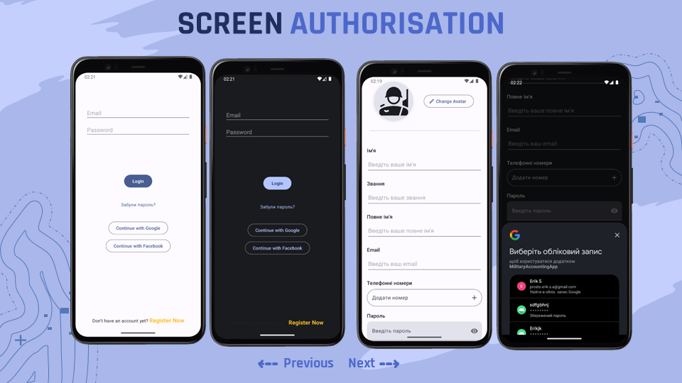
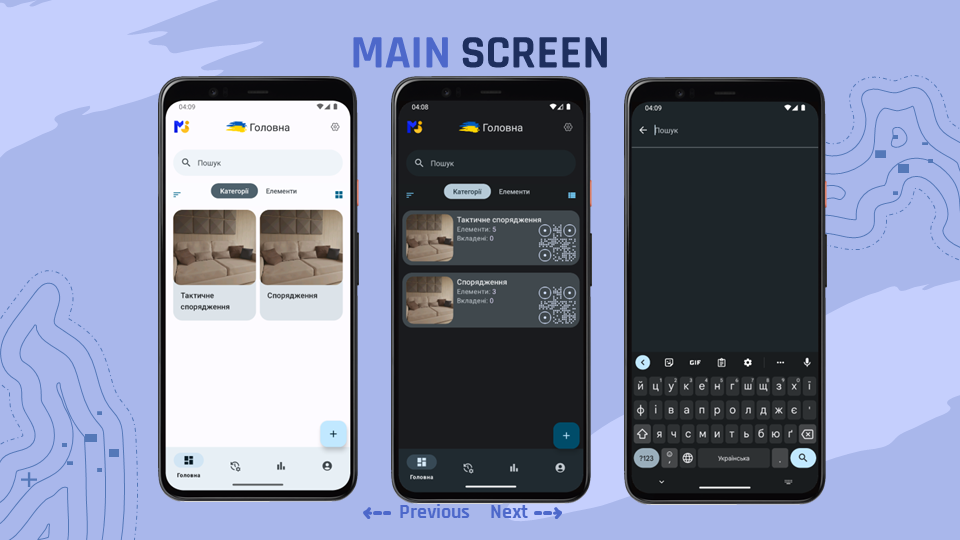
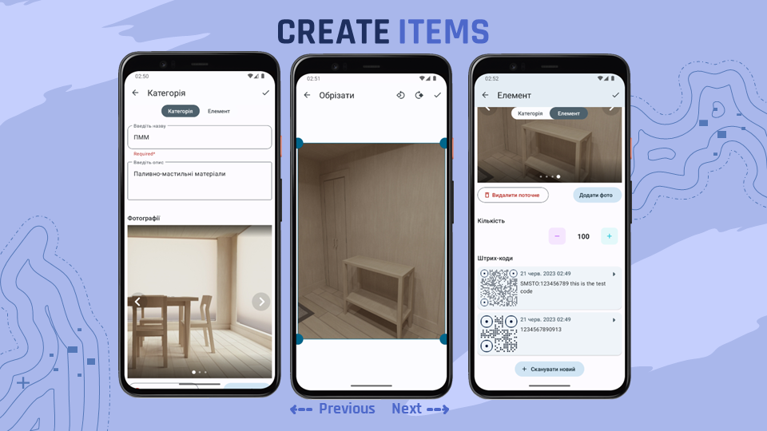
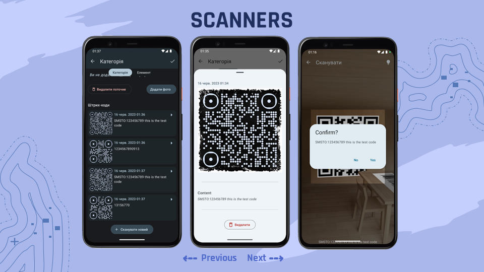
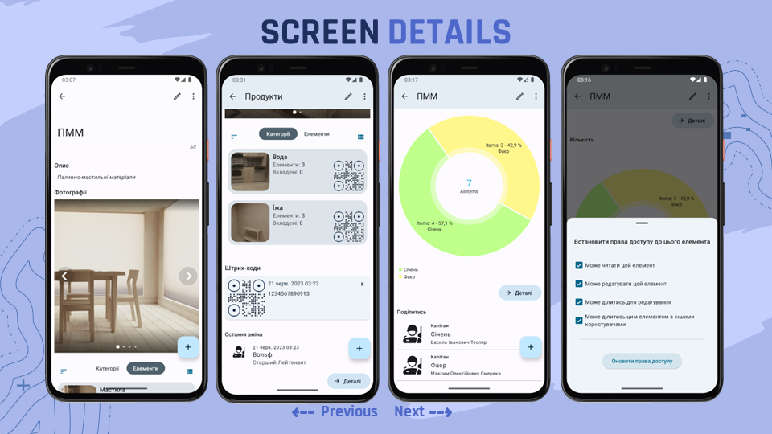
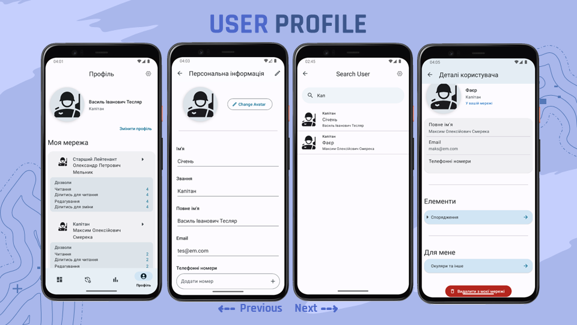
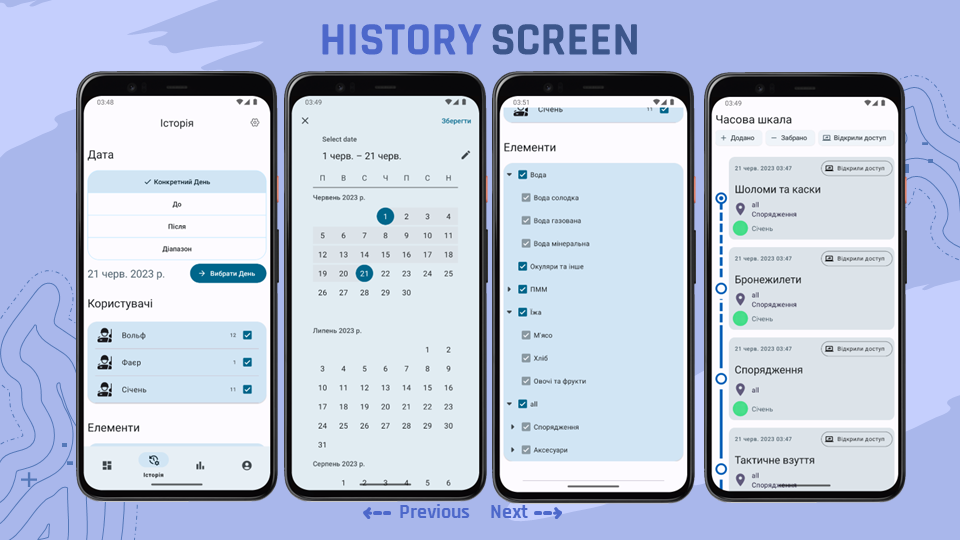
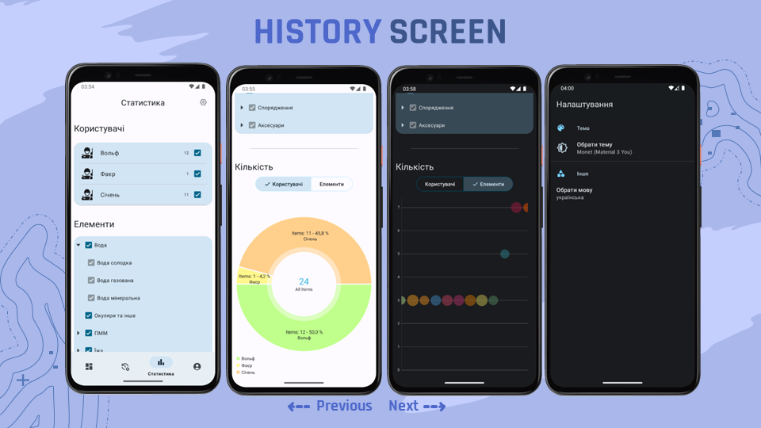

> --------------

[//]: # (👇)

## :point_down: Download

***Download and test latest version***

--------------

[//]: # (## 🛠️ Project Setup )

## :hammer_and_wrench: Project Setup

#### Android Studio IDE

You need to have [Android Studio](https://developer.android.com/studio) to set
up this project locally. After downloading all the requirements, please import the project into
Android Studio, build the project, and click Run.

#### Gradle

Build or run the project with terminal using
`./gradlew assembleDebug` or `./gradlew assembleRelease` command.

--------------------------------

[//]: # (## 🛠️ Architecture)

## :hammer_and_wrench: Architecture

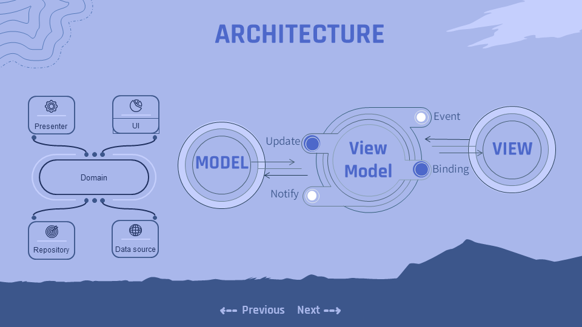

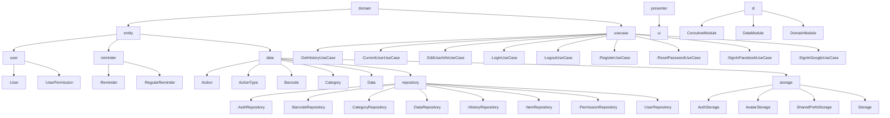

--------------

[//]: # (## 🛠 Tech stack & Open-source libraries)

## :building_construction: Tech stack & Open-source libraries

- Minimum SDK level 21
- [Firebase](https://firebase.google.com/) - app development platform
    - [`Authentication`](https://firebase.google.com/docs/auth/android/start?authuser=1)
    - [`Cloud Firestore`](https://firebase.google.com/docs/firestore/quickstart?authuser=1)
    - [`Storage`](https://firebase.google.com/docs/storage/android/start?authuser=1)
    - [`Security Rules`](https://firebase.google.com/docs/rules?authuser=1)
- [Kotlin](https://kotlinlang.org/) - First class and official programming language for Android development.
- [Coroutines](https://kotlinlang.org/api/kotlinx.coroutines/kotlinx-coroutines-core/kotlinx.coroutines.flow/-flow/) -
  For asynchronous and more..
- [Coroutines Flow](https://kotlinlang.org/docs/reference/coroutines-overview.html) - For streams and alternative Live
  Data..
- [Hilt](https://developer.android.com/training/dependency-injection/hilt-android) - Dependency injection library for
  Android that reduces the boilerplate of doing manual dependency injection in your project
- [Android Architecture Components](https://developer.android.com/topic/libraries/architecture) - Collection of
  libraries that help you design robust, testable, and maintainable apps.
    - Lifecycle: Observe Android lifecycles and handle UI states upon the lifecycle changes.
    - [ViewModel](https://developer.android.com/topic/libraries/architecture/viewmodel) - Stores UI-related data that
      isn't destroyed on UI changes.
    - [ViewDataBinding](https://developer.android.com/topic/libraries/view-binding) - Generates a binding class for each
      XML layout file present in that module and allows you to more easily write code that interacts with views.
- [Glide](https://github.com/bumptech/glide) - An image loading library for Android backed by Kotlin Coroutines.
- [Timber](https://github.com/JakeWharton/timber): A logger with a small, extensible API.
- [Material Components for Android](https://github.com/material-components/material-components-android) - Modular and
  customizable Material Design UI components for Android.

> --------------

[//]: # (## 🤝 Join the team)

## :handshake: Join the team

Contributions are what make the open source community such an amazing place to be learn, inspire, and create. Any
contributions you make are **greatly appreciated**.

1. Open an issue first to discuss what you would like to change. Report issues in
   the [issue tracker](https://github.com/GitaristErik/MilitaryAccountingApp/issues)
1. Fork the Project
1. Create your feature branch (`git checkout -b feature/amazing-feature`)
1. Commit your changes (`git commit -m 'Add some amazing feature'`)
1. Push to the branch (`git push origin feature/amazing-feature`)
1. Open a [pull request](https://opensource.guide/how-to-contribute/#opening-a-pull-request)

> **💬 Discuss?**
>
> Have any questions, doubts or want to present your opinions, views? You're always welcome. You can
> start [discussions](https://github.com/GitaristErik/MilitaryAccountingApp/discussions).
>
> --------------

[//]: # (## ✍️ Author)

## :pencil2: Author

👤 **GitaristErik**

* Linked-In: <a href="https://www.linkedin.com/in/erik-sukhan/" target="_blank">***GitaristErik***</a>
* Email: ***GitaristErik@gmail.com***

[//]: # (Feel free to ping me 😉)

> --------------

[//]: # (## ⭐️ Stats)

## :star: Stats

<a href="https://star-history.com/#GitaristErik/MilitaryAccountingApp&Date">
  <picture>
    <source media="(prefers-color-scheme: dark)" srcset="https://api.star-history.com/svg?repos=GitaristErik/MilitaryAccountingApp&type=Date&theme=dark" />
    <source media="(prefers-color-scheme: light)" srcset="https://api.star-history.com/svg?repos=GitaristErik/MilitaryAccountingApp&type=Date" />
    
  </picture>
</a>

[//]: # (## 📃 License)

## :scroll: License

> **Warning**
>
> Please be aware of the following crucial points regarding the GNU General Public License, Version 3 (GPL-3.0):
> - This software is distributed under the terms of the [GNU General Public License, Version 3](LICENSE).
> - Any modifications or derivative works you create must also be licensed under the GPL-3.0.
> - The software is provided "as is," without any warranties or guarantees.
>
> **By using this software, you agree to abide by the terms of the GPL-3.0.**
>
> *For more details, please refer to the [LICENSE](LICENSE) file.*

<table><td>
<a href="#start-content">👆 Scroll to top</a>
</td></table>

